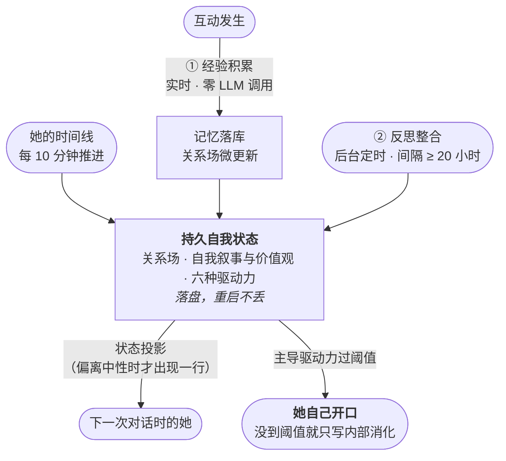
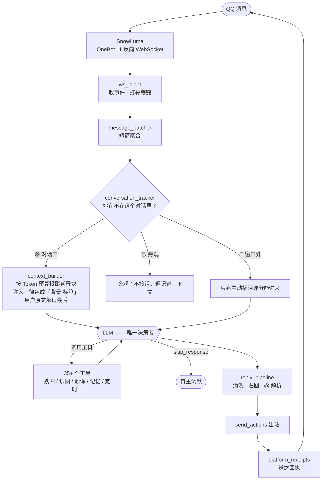

<div align="center">

# 🍬 小糖糖

**在 QQ 上活着的 AI 伙伴**

她不是客服机器人——不是 `f(消息, 记忆, 人格卡) → 回复` 的一次次独立函数调用。

[](../../releases)


</div>

---

## 她不是客服机器人

绝大多数聊天机器人的样子是这样的：每次收到消息，把历史、记忆、人格卡拼成一个 prompt，调一次模型，拿到回复，结束。**消息之间，它不存在。**

小糖糖不是这样造的。她有**独立于消息而存在的自我状态**——自己的时间感、精力和心情会自主波动；关系是她存在的一部分，不是查询结果；三观是从几千次互动里长出来的，不是人格卡里的设定。

> **LLM 提供瞬间；架构提供生命。**

这不是一句口号，是三条能验证的设计约束：

**她的状态不等人。** 精力与心情的更新函数按**墙上时钟**走，签名里没有消息参数；一个独立的后台循环每 10 分钟无条件推进她的状态——**没有人跟她说话的深夜，她照样在变**。

**她有内在张力。** 六种驱动力（社交渴望 / 承诺压力 / 信息饥渴 / 表达冲动 / 好奇心 / 回避欲）各有自己的积累速率与阈值。同一个"精力"变量会把两种对立需求往相反方向推：疲惫时回避欲加速 1.8 倍，同时社交渴望被压到 0.2 倍。**冲突不是靠规则表解决的，是靠选择解决的**——没有哪个驱动力过阈值时，她什么都不做。

**她的记忆分真伪。** 每条记忆有 `active / retracted / superseded` 状态。被否定的事实会被标记撤销，**但撤销不改它的"重要性"**——重要性衡量的是相关性，不是真值。被纠正时，改写的是真值状态与证据链，不是把那条记忆删掉了事。

## 她是怎么活的



> 图里每个方框都对应一个真实模块，不是示意——`agent/self_state.py`、`agent/drives.py`、`agent/reflection.py`、`agent/handler_autonomy.py`。各驱动力的积累率、阈值与能量调制等数值依据，以及设计取舍，见 [docs/开发规划/](docs/开发规划/)。

## 一条消息的旅程



两条待客原则藏在链路里：**LLM 是唯一决策者**（系统只提供能力与客观信号，不替它判断该不该说话）；**沉默是一项工具**（`skip_response` 是一个正常的 function call，调用后系统不补发文字）。

## 工程上怎么保证这些不腐化

上面那些设计，随便一个 PR 都能悄悄破坏掉——让人设变成关键词触发、让第二处判定点偷偷长出来、让写了的基础设施永远不接线。

所以这个项目近两千个测试里，**有 500 多个不是在测功能，是在守着架构**——它们的断言对象不是函数的输入输出，而是**源码本身**。想自己数一遍：

```bash
# 读生产源码做断言的测试文件（排除本 README 自己的契约测试）
grep -l 'read_text(\|ast.parse' tests/*.py | grep -v test_release_readme_contract | wc -l
python -m pytest $(grep -l 'read_text(\|ast.parse' tests/*.py \
    | grep -v test_release_readme_contract) --collect-only -q | tail -1
```

| 闸门 | 防的是什么 | 怎么防 |
|---|---|---|
| **零调用扫描** | "写了基础设施却没接进业务" | AST 遍历 `agent/` 全部公共函数，任何找不到生产调用方的直接红灯。例外必须登记并写理由，且**函数删了、登记没删也红灯** |
| **管线契约** | "引擎在转，离合器没接上" | 关键入口必须在指定文件被调用。例如驱动力投影必须经上下文组装器注入——防止某处直接追加造成双重注入 |
| **判定单一来源** | 第二处判定点悄悄长出来 | 某个判定只允许来自唯一的决策函数；出现第三处赋值即红灯。这条上线当天就抓出两处遗漏 |
| **函数体禁词** | 旧的分支逻辑复活 | 某些函数体内不得出现被禁的判定方式，机器禁止——不是写在文档里靠自觉 |

这些闸门不是设计出来的，是**踩出来的**：项目记录着 29 条错误模式（拆东墙补西墙、用关键词代替语义判断、缩进吞掉整段代码……），每一条都从"记住别再犯"变成了"机器不让你犯"。

```bash
python -m pytest tests/ -q
```

## 诚实边界

- **不假装她有意识，也不让她"觉醒"。** 追求的是连贯、发展、诚实的"她自己的存在方式"——不是演一个有心智的假象。
- **数据在你自己机器上。** 记忆、关系、自我状态都是本地 SQLite 与本地文件，不上传。
- **缺组件就降级，不装死。** 没有语音模型就打字，没有识图就说不懂，没有知识库就靠对话本身——186 处降级路径分布在 24 个模块里，任何一个可选组件缺席都不会让整条链路挂掉。

## 她能做什么

| | |
|---|---|
| **聊天** | 群聊与私聊；窗口感知、旁观与退让；主动插话；956 张表情包的情绪索引 |
| **记得** | 从对话里提取事实、合成画像、维护关系；被纠正时能改，也能撤销 |
| **工具** | 联网搜索 · 天气 · 计算 · 翻译 · 识图 · 画图 · 知识库检索 · 文档解析 · 记忆查询 · 唱歌 · 发语音 · 定时提醒（原生 Tool Calling，她自主决定用不用） |
| **说话** | GPT-SoVITS 自己的声线，含 7 种情绪参考音频；唱歌是 41 首预录成品，点歌即播 |
| **角色** | 糖糖 / 米雪儿 / 丛雨，`/角色` 切换，人格卡 + 声线 + 表情包联动 |

## 上手

到 [Releases](../../releases) 下载 **`小糖糖-v1.0.zip`**，解压后双击 `安装糖糖.bat`：

1. **勾你要的功能** —— 默认已勾好「聊天 + 高质量记忆 / 唱歌 / 图形控制台」，够用了。想要糖糖开口说话就勾上语音（约 6.5G 模型自动下载）；想让她看懂图就勾识图（约 2.5G，也可走云端、零下载）。
2. **等它跑完** —— 依赖、模型、配置全部自动。断网直接重跑，已下载的不会重来。
3. **双击 `启动控制台.bat`** —— 填机器人 QQ、你自己的 QQ、模型 API Key，然后启动 SnowLuma 扫码登录。

> **还有一步**：SnowLuma 是连接 QQ 所需的协议端，属于第三方项目，其许可协议不允许随本项目分发，需要你从 [官方发布页](https://github.com/SnowLuma/SnowLuma/releases) 下载一次（Windows x64 版），解压到 `SnowLuma/` 下。安装程序会提醒你；也可以用任意其他 OneBot 11 反向 WebSocket 实现替代。

已经 clone 了仓库？同样双击 `安装糖糖.bat` 即可，效果一致。

## 目录结构

```text
agent/                核心对话、记忆、人格、自治与工具模块（74 个业务模块）
napcat/               OneBot 11 协议适配（目录名沿用历史，现接 SnowLuma）
knowledge/            知识库——糖糖可检索的背景知识，递归扫描 .md / .txt
scenarios/            场景包——心理陪伴、亲密等，控制台可挂载到任何人身上
stickers/             默认表情包（956 张）+ 情绪索引
stickers_cg/          特殊 CG 表情
stickers_michele/     米雪儿角色专属表情（随安装包自带）
stickers_murasame/    丛雨角色专属表情（随安装包自带）
songs/                预录歌曲（41 首成品 + 歌词，随安装包自带）
gpt-sovits/           语音引擎与声线模型落点（勾选语音后由安装程序自动获取）
docs/                 架构图谱、决策记录、用户手册、技术报告
tools/                安装、诊断、维护与通用辅助脚本
role_card.md          人格定义第一来源（另有 michele / murasame 两张）
main.py               服务启动入口
糖糖控制台_qt.py       图形控制台
```

> clone 主仓时，`songs/` 与角色贴图目录里只有一份摆放说明——音视频与贴图体积大，随安装包分发；跑一次 `安装糖糖.bat` 即可补齐。

## 文档

- [docs/模块地图.md](docs/模块地图.md) —— 代码地图：74 个业务模块按职责分七层，附推荐阅读路径
- [docs/架构图谱/糖糖架构图谱.html](docs/架构图谱/糖糖架构图谱.html) —— 78 个模块、160 条依赖关系的交互式图谱，按七层着色（下载后用浏览器打开，首次加载需联网取渲染库）
- [docs/decisions/](docs/decisions/) —— 6 篇 ADR：动作信封、送达回执、永久事实归账、定时任务重试所有权……
- [docs/开发规划/](docs/开发规划/) —— 19 篇技术设计与规划报告
- [docs/用户手册/使用说明.md](docs/用户手册/使用说明.md) —— 面向使用者的详细说明
- [CLAUDE.md](CLAUDE.md) —— 给 AI 协作者的项目准则：架构原则、29 条反模式、改动前检查清单

## 许可与合规

角色卡所涉及的形象与素材，其权利归原著作权人或相应权利人所有；使用者应自行确认素材、模型、平台和第三方服务的授权与合规要求。糖糖通过第三方协议端接入 QQ，请自行评估账号风险。

本项目代码以 [MIT 许可证](LICENSE) 发布。
